% Gravitational lensing   in wave optics
% Job Feldbrugge and Neil Turok

<!--- <a href="">Feldbrugge, and Turok (2020)</a> ---> 

Gravitational lensing in the thin-lens approximation, where the region over which the radiation is significantly deflected is small compared to the distance the radiation travels from the source to the lens and from the lens to the observer, can be expressed in terms of the two-dimensional Kirchhoff-Fresnel integral

$$\psi(\boldsymbol{\mu}) = \frac{\nu}{2\pi i} \int e^{i \nu \left[(\boldsymbol{x}-\boldsymbol{\mu})^2/2 + \varphi(\boldsymbol{x})\right]} \mathrm{d}\boldsymbol{x}$$

with the position on the sky $\boldsymbol{\mu}$, the position on the lens plane $\boldsymbol{x}$, and the frequency of the radiation $\nu$ in units of the Einstein radius. For the gravitational lensing by $N$ point-sources positioned at $\boldsymbol{x}_i$ the phase variation $\varphi$ of the form

$$\varphi(\boldsymbol{x}) =- \sum_{i=1}^N f_i \log(\|\boldsymbol{x} - \boldsymbol{x}_i\|),$$

with $f_i$ the relative strength of the lenses (determined by the masses of the sources), with $f_1+\dots + f_N=1$. The intensity is defined as the magnitude squared of the amplitude 

$$I(\boldsymbol{\mu}) = | \psi(\boldsymbol{\mu})|^2.$$

When the frequency is small compared to the Einstein radius, or when the radiation is incoherent, the geometric optics limit is a good approximation to this integral. However, when these conditions are not fulfilled we need to evaluate the highly oscillatory Kirchhoff-Fresnel integral to model the interference pattern. We will here describe the evaluation of the integral with Picard-Lefschetz theory.

### Single gravitational lens
Lensing by a single point source, *i.e.*, $\varphi(\boldsymbol{x}) = -\log(\|x\|)$, is one of the few lensing integrals with a closed form solution

$$I(\boldsymbol{\mu}) = \frac{\pi \nu}{1-e^{-\pi \nu}} |{}_1F_1(i \nu / 2, 1; i \nu \mu^2/2)|^2,$$

with the norm $\mu = \|\boldsymbol{\mu}\|$ and the hypergeometric function ${}_1F_1$. See Fig. 1 for the interference patterns of the single gravitational lens.

<figure>
<table align='left' width=100% id="FIG">
<tr>
<td></td>
<td></td>
<td>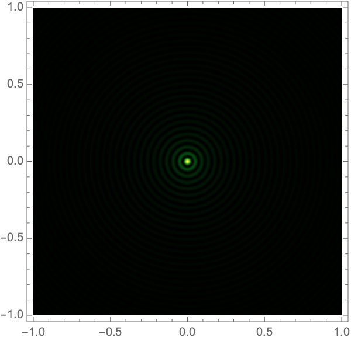</td>
<td>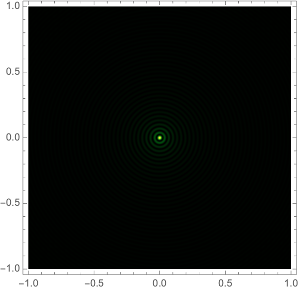</td>
</tr>
 </table>
 <figcaption> Fig. 1- The lensing of a single gravitational lens for the frequencies $\nu=25,50,75$ and $100$ (respectively from left to right). </figcaption>
</figure>

This is a beautiful result, but is unfortunately degenerate as a small perturbation of the phase variation will induce a dramatic change in the structure of the caustics and the interference pattern. More realistic is the occurrence of the single gravitational lens with a shear field,

$$\varphi(\boldsymbol{x}) = - \log(\|\boldsymbol{x}\|) + \frac{1}{2}\gamma (x^2 - y^2),$$

with $\boldsymbol{x}=(x,y)$ and the strength of the shear $0\leq \gamma \leq 1$. The additional term could, for example, represent the tidal force form an external mass located a distance $\gamma^{-1/2}$ from the lens. In geometric optics, the single lens with a shear field induces the Lagrangian map,

$$\xi(\boldsymbol{x}) = \left(1-\frac{1}{\|\boldsymbol{x}\|}\right) \boldsymbol{x} +\gamma (-x,y),$$

sending points from the lens-plane to the screen. This map forms a caustic at the critical curve defined by the condition $\det(\nabla \xi) = 0$,

$$\mathcal{M} =\left \{ r (\cos \theta, \sin \theta) \,\bigg| \,r = \frac{1}{\sqrt{1- \gamma^2}} \sqrt{ \sqrt{1-\gamma^2 \sin^2 2 \theta} -\gamma \cos 2 \theta} \text{ and } \theta \in [0,2\pi)\right\}.$$

See Fig. 2 for the critical curve for the shear $\gamma=0.1, 0.2, 0.3$ and $0.4$.
<figure>
<table align='left' width=100% id="FIG">
<tr>
<td>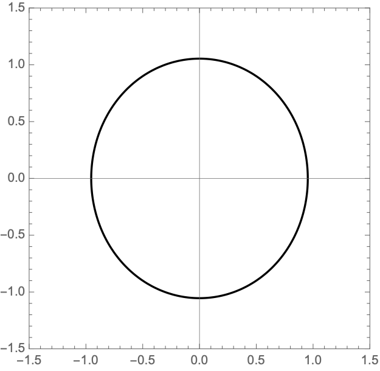</td>
<td>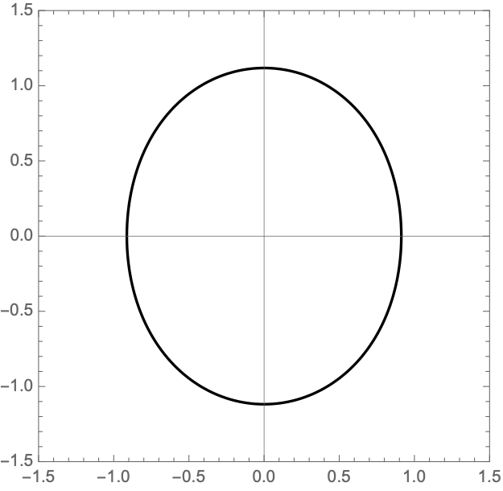</td>
<td>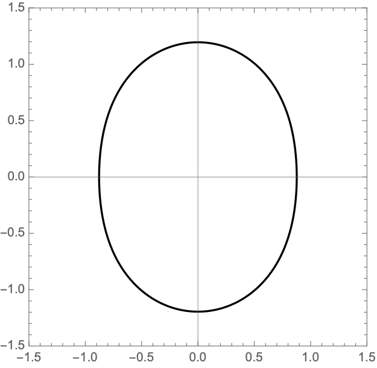</td>
<td></td>
</tr>
 </table>
 <figcaption> Fig. 2 - The critical curve for $\gamma = 0.1,0.2,0.3,$ and $0.4$ (respectively from left to right). </figcaption>
</figure>

The Lagrangian map maps the critical curve to the caustic curve $\xi(\mathcal{M})$ consisting of four fold curves running between four cusp points forming a curved diamond. This diamond is the curve at which the intensity in the geometric optics approximation diverges. The Kirchhoff-Fresnel integral has generically four saddle points, with two or four being real depending on whether $\boldsymbol{\mu}$ is outside or inside the caustic curve. The outside and inside of the caustic curve are respectively double- and quadruple-image regions. 

To evaluate the lens in wave optics, we use polar coordinates centered at the lens $\boldsymbol{x} = r(\cos \theta , \sin \theta )$. In these coordinates, the integrand is an analytic function of the radial and angular coordinates, 

$$\psi(\boldsymbol{\mu}) =\frac{\nu}{2\pi i} \int_{0}^\infty \int_0^{2\pi} e^{i \nu \left[ ((r\cos \theta - \mu_x)^2 + (r\sin \theta - \mu_y)^2) / 2 - \log r + \frac{\gamma }{2} r^2(\cos^2\theta - \sin^2\theta) \right]} r \mathrm{d} \theta \mathrm{d} r,$$

with $\boldsymbol{\mu} = (\mu_x,\mu_y)$. As the angular integral is over a compact domain, we will use Picard-Lefschetz theory of the radial integral

$$g_{\theta}(\boldsymbol{\mu}) = \int_{\mathcal{J}_\theta} e^{i \nu \left[ ((r\cos \theta - \mu_x)^2 + (r\sin \theta - \mu_y)^2) / 2 - \log r + \frac{\gamma }{2} r^2(\cos^2\theta - \sin^2\theta) \right] + \log r} \mathrm{d} r,$$

with the Lefschetz-thimble $\mathcal{J}_\theta$ the complex continuous deformation of the original integration domain $(0,\infty)$. This deformation is obtained using Picard-Lefschetz theory, removing the oscillations from the radial integral (see Fig. 3 for an example).

<figure>

<figcaption> Fig. 3 - The Picard-Lefschetz diagram for the radial variable for shear $\gamma=0.2$ and the angular variable $\theta = 0$. The black and blue curves are the steepest descent and ascent curves corresponding to the saddle points (the red points) of the $h$-function (the background image). The original integration domain $(0,\infty)$ is deformed to the Lefschetz thimbles (the blue curve) removing the oscillations of the integrand. The white vertical line is the branch cut of the logarithm, which we have placed to avoid the Lefschetz thimble.</figcaption>
</figure>

The remaining integral over the angular parameter 

$$\psi(\boldsymbol{\mu}) =\frac{\nu}{2\pi i} \int_0^{2\pi} g_\theta (\boldsymbol{\mu})\mathrm{d}\theta,$$

can be evaluated with traditional numerical methods. See Fig. 4 for the interference patterns of the single gravitational lens with a shear of $\gamma=0.1,0.2,0.3, 0.4$ and $0.5$ for the frequencies $\nu=25,50,75,$ and $100$.

<figure>
<table align='left' width=100% id="FIG">
<tr>
<td></td>
<td></td>
<td></td>
<td>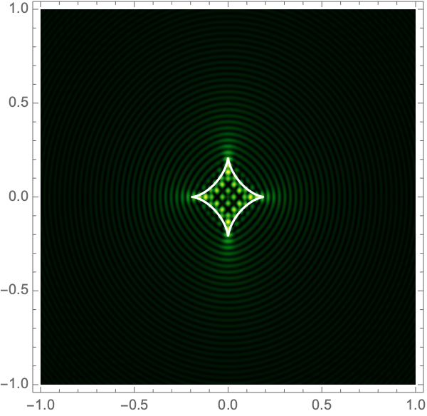</td>
</tr>
<tr>
<td>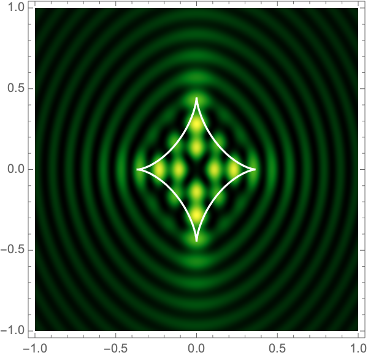</td>
<td></td>
<td></td>
<td>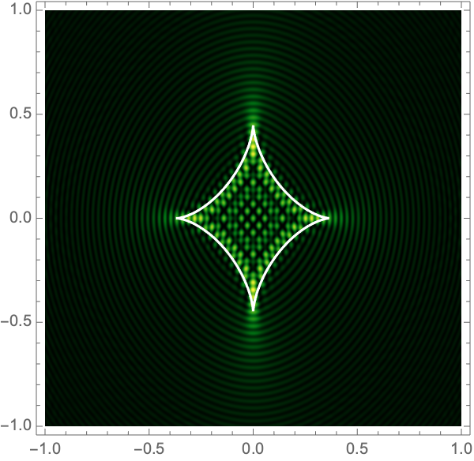</td>
</tr>
<tr>
<td>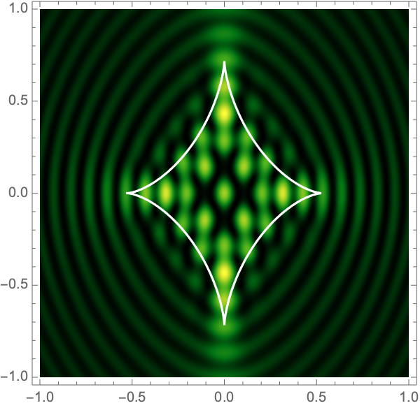</td>
<td>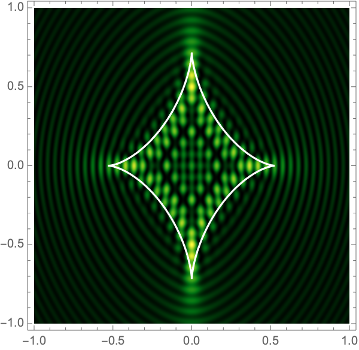</td>
<td></td>
<td>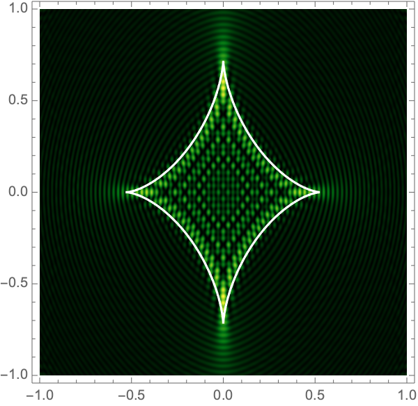</td>
</tr>
<tr>
<td>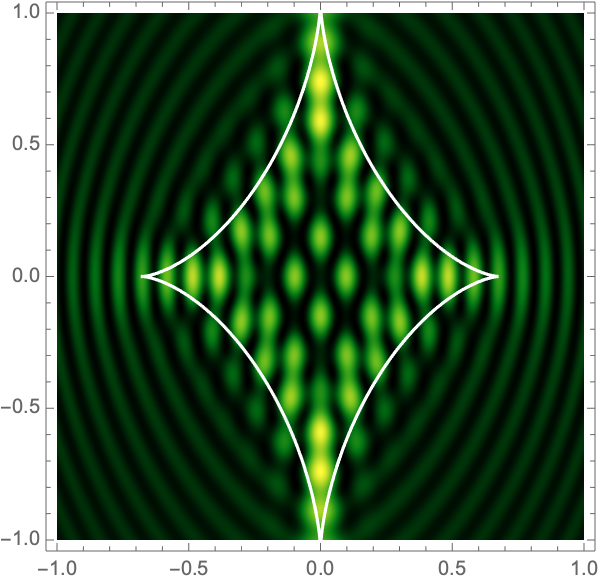</td>
<td></td>
<td></td>
<td>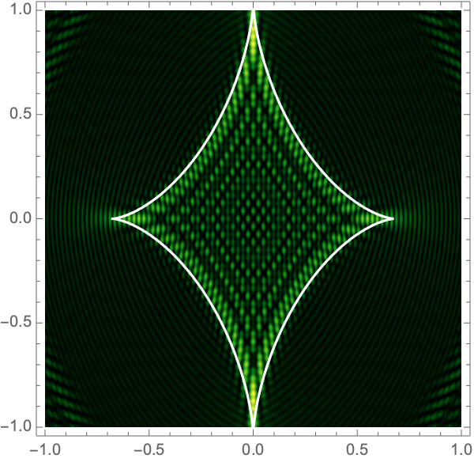</td>
</tr>
 <tr>
 <td></td>
 <td>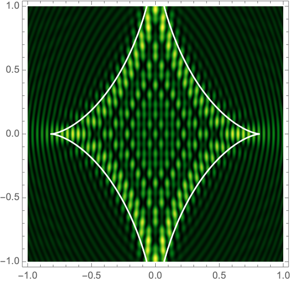</td>
 <td></td>
 <td></td>
 </tr>
 </table>
 <figcaption> Fig. 4 - The lensing of a single gravitational lens with shear $\gamma =0.1, 0.2, 0.3, 0.4$ and $0.5$ (respectively the upper to the lower rows) and for the frequencies $\nu=25,50,75$ and $100$ (respectively the left to the right collumns). The white diamond is the caustic of the geometric optics approximation. The rings at the outskirts for high frequency and shear are aliasing artifacts. </figcaption>
</figure>

### Binary gravitational lens
The binary gravitational lens is described by the phase variation

$$\varphi(\boldsymbol{x}) = -f_1 \log(\|\boldsymbol{x} - \boldsymbol{x}_1\|) - f_2 \log(\|\boldsymbol{x} - \boldsymbol{x}_2\|).$$

For simplicity, we will let $\boldsymbol{x}_1 = (-a,0)$ and $\boldsymbol{x}_1 = (a,0)$ for some $a>0$. The Lagrangian map

$$\xi(\boldsymbol{x}) = \left(x - \frac{f_1(x+a)}{\| \boldsymbol{x} - \boldsymbol{x}_1\|} - \frac{f_2(x-a)}{\| \boldsymbol{x} - \boldsymbol{x}_2\|}, y - \frac{f_1 y}{\| \boldsymbol{x} - \boldsymbol{x}_1\|} - \frac{f_2 y}{\| \boldsymbol{x} - \boldsymbol{x}_2\|}\right)$$

can be used to construct the critical, $\mathcal{M} = \{\boldsymbol{x}| \det \nabla \xi(\boldsymbol{x}) = 0\}$, and the caustic curve, $\xi(\mathcal{M})$. It is straightforward to show that the intensity outside the caustic curve consists of three images. Two images which are mainly lensed by the two lenses and one image lensed by the combined system. The inside of the caustic curve is a quintuple-image region.  

As with the single gravitational, we cannot apply Picard-Lefschetz theory to the Kirchhoff-Fresnel integral in Carthesian coordinates since the integrand is not analytic. Instead we use elliptic coordinates, $\boldsymbol{x}(\tau,\sigma) = a(\cosh \tau \cos \sigma, \sinh \tau \sin \sigma)$, with $0 < \tau < \infty$ and $0 < \sigma \leq 2\pi$. Geometrically, the elliptic coordinates has two foci at the locations of the binary $\boldsymbol{x}_1$ and $\boldsymbol{x}_2$. The constant $\tau$ contours form ovals around the foci (the red curves in Fig. 5). The constant $\sigma$ contours pass between the to foci (the blue curves in Fig. 5). Note that the variables $\tau$ and $\sigma$ resemble the radial and angular polar variables $r$ and $\theta$. 

<figure>
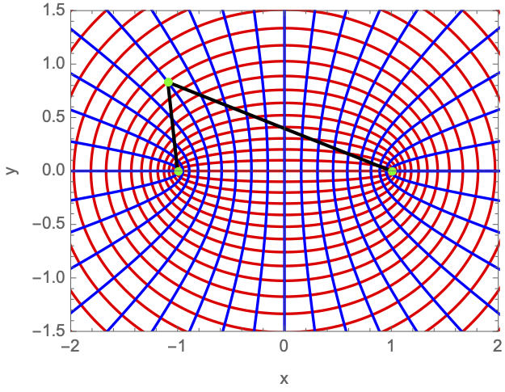
<figcaption> Fig. 5 - Elliptic coordinates for $a=1$. The red curves are the constant $\tau$ contours. The blue cirves are constant $\sigma$ contours. The black line segments connect the upper green point to the foci, at $\boldsymbol{x}=(\pm 1, 0)$, of the elliptic coordinate system.</figcaption>
</figure>

In elliptic coordinates, we obtain the identities

$$ \begin{aligned}
\|\boldsymbol{x} - \boldsymbol{x}_1\| &= a(\cosh \tau + \cos \sigma),\\
\|\boldsymbol{x} - \boldsymbol{x}_2\| &= a(\cosh \tau - \cos \sigma),
\end{aligned}$$

and the Jacobian

$$J(\tau,\sigma) = \frac{a^2}{2} \left( \cosh 2\tau - \cos 2 \sigma\right).$$

Following the calculation for the single gravitational lens, we perform the radial $\tau$-integral using Picard-Lefschetz theory

$$g_\sigma(\boldsymbol{\mu}) = \int_{\mathcal{J}_\sigma} e^{i \nu \left[ \frac{1}{2}(\boldsymbol{x}(\tau,\sigma) - \boldsymbol{\mu})^2 - f_1 \log(a(\cosh \tau + \cos \sigma))- f_2 \log(a(\cosh \tau - \cos \sigma))\right] + \log J(\tau,\sigma)}\mathrm{d}\tau.$$

For this integral, it turns out to be most efficient to extend the original integration domain for $\tau$ to the real line $\mathbb{R}$. See Fig. 6 for two examples of the thimble $\mathcal{J}_\sigma$. 

<figure>
<table align='left' width=100% id="FIG">
<tr>
<td>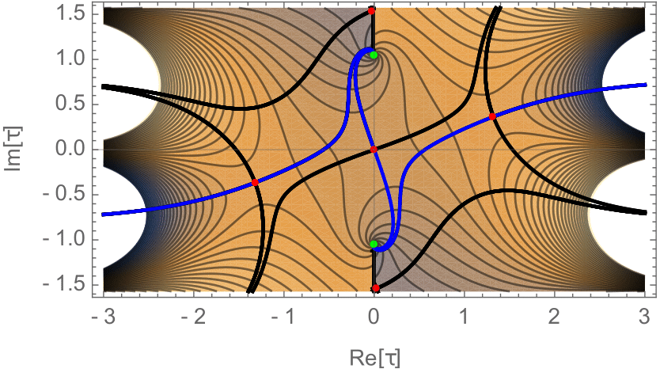</td>
<td>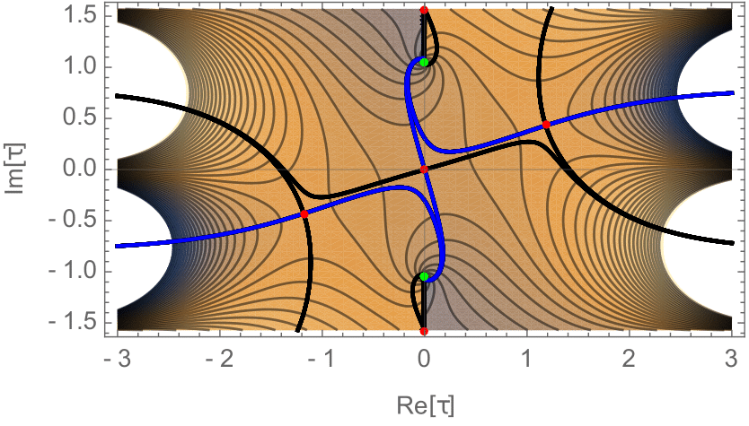</td>
</tr>
 </table>
 <figcaption> Fig. 6 - The Picard-Lefschetz diagram in the complex $\tau$-plane for $\nu=1,a=1$ for $\boldsymbol{\mu}=\boldsymbol{0}$ and $(1,0)$. The red points are the saddle points, the green points are the branch points and the blue curves are the relevant steepest descent contours. </figcaption>
</figure>

The amplitude is now expressed as an angular integral over a compact domain which we evaluate using conventional integration techniques

$$\psi(\boldsymbol{\mu}) = \frac{\nu}{4\pi i} \int_0^{2\pi} g_{\sigma}(\boldsymbol{\mu}) \mathrm{d}\sigma.$$

For an illustration of the intensity map for lens strenghts $f_1=1/3, f_2=2/3$, with a seperation $a=0.1,0.2,\dots,1.0$, and the frequencies $\nu=25,50,75,$ and $100$ see Fig. 7.

<figure>
<table align='left' width=100% id="FIG">
<tr>
<td></td>
<td>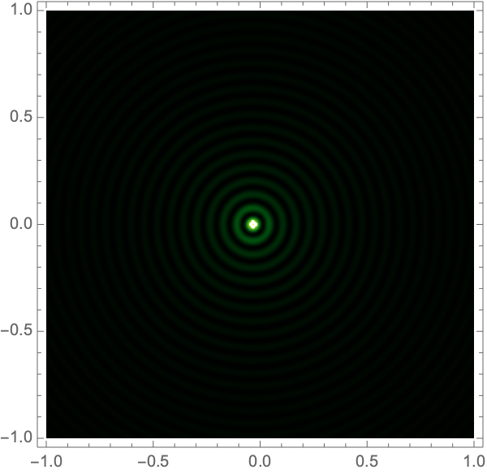</td>
<td>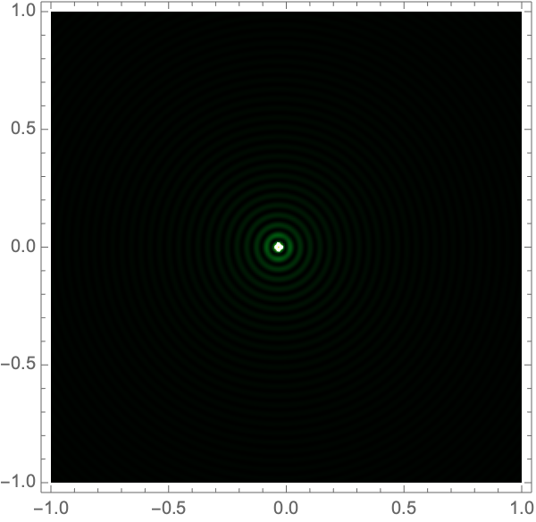</td>
<td></td>
</tr>
<tr>
<td></td>
<td>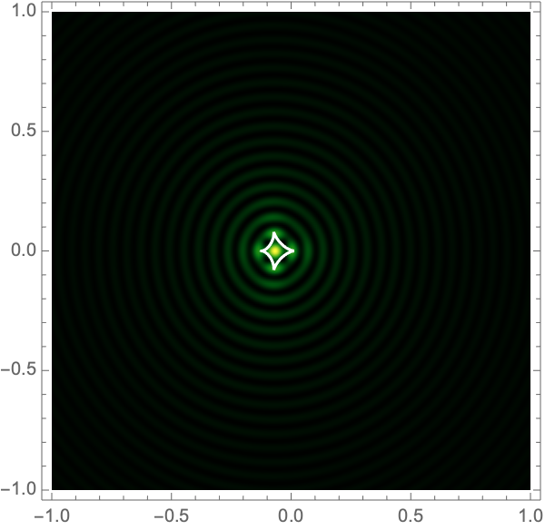</td>
<td>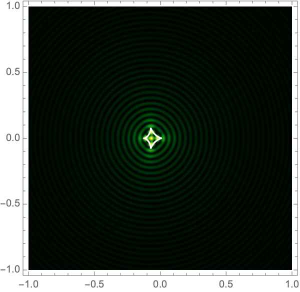</td>
<td>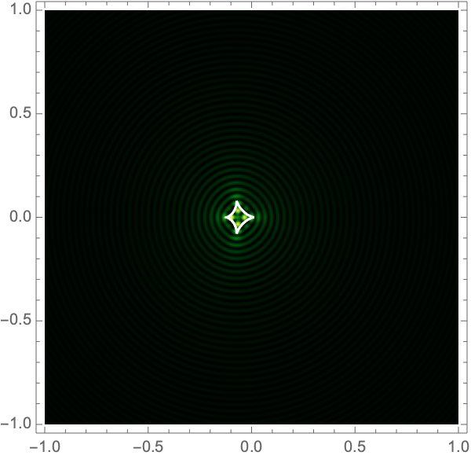</td>
</tr>
<tr>
<td>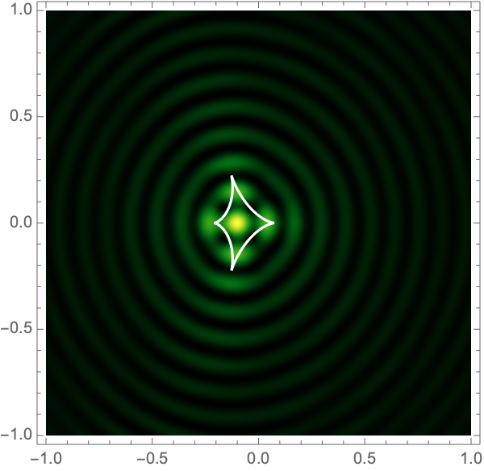</td>
<td>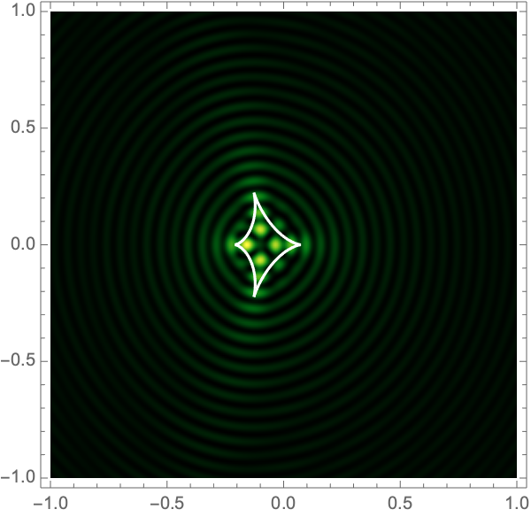</td>
<td>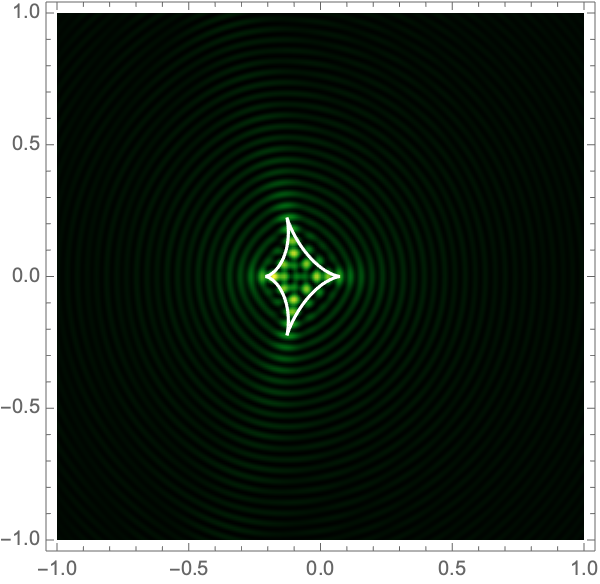</td>
<td>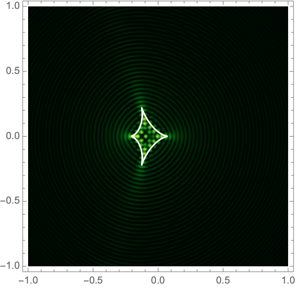</td>
</tr>
<tr>
<td>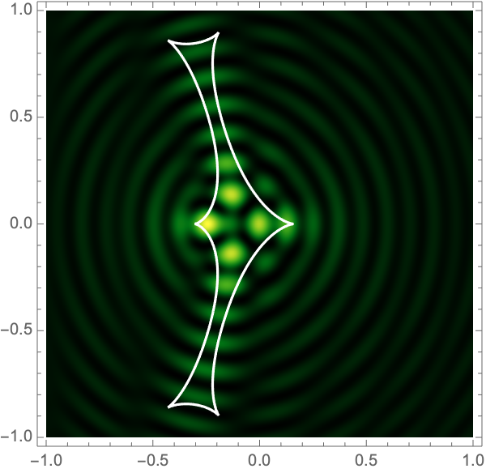</td>
<td>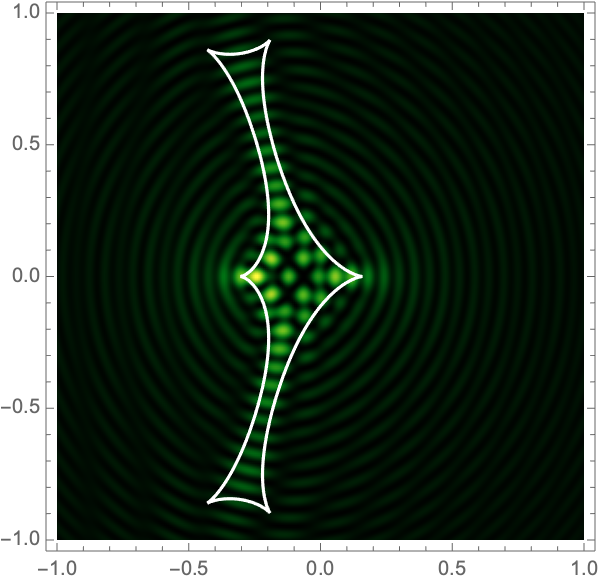</td>
<td>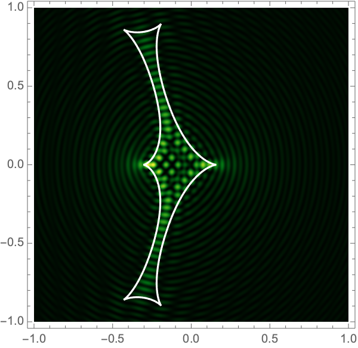</td>
<td></td>
</tr>
<tr>
<td></td>
<td>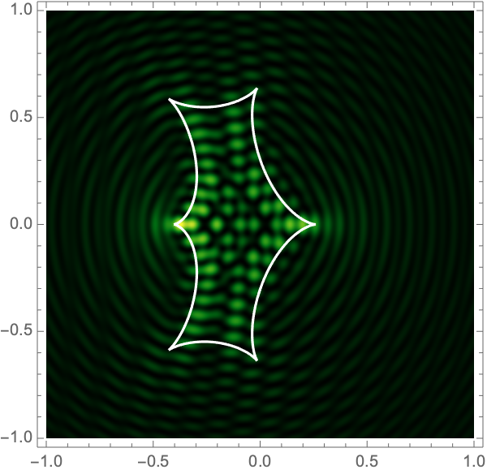</td>
<td>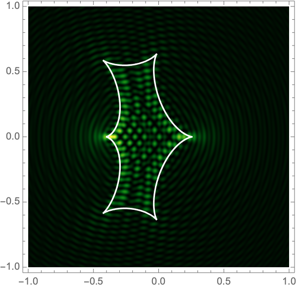</td>
<td></td>
</tr>
<tr>
<td>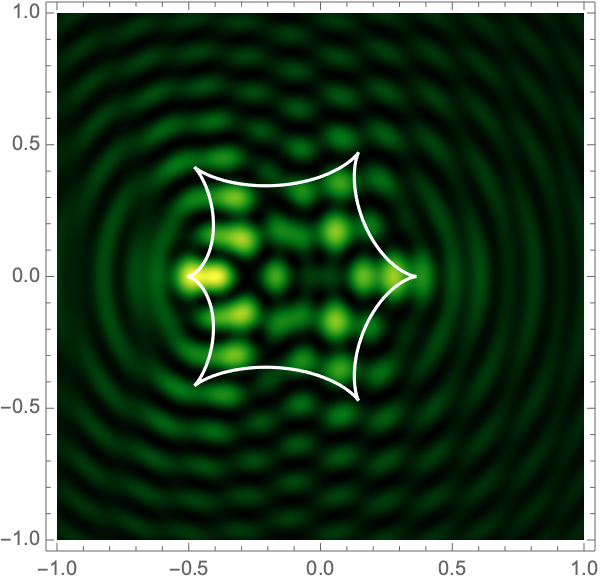</td>
<td>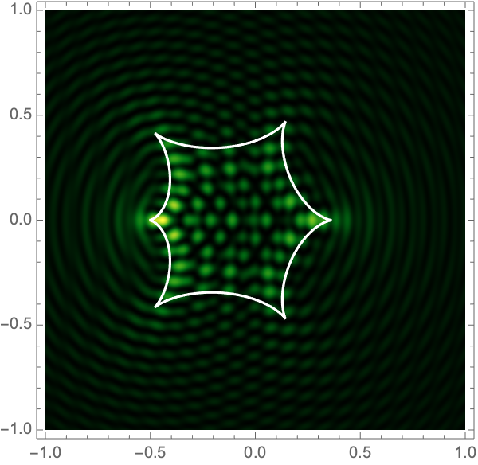</td>
<td></td>
<td></td>
</tr>
<tr>
<td>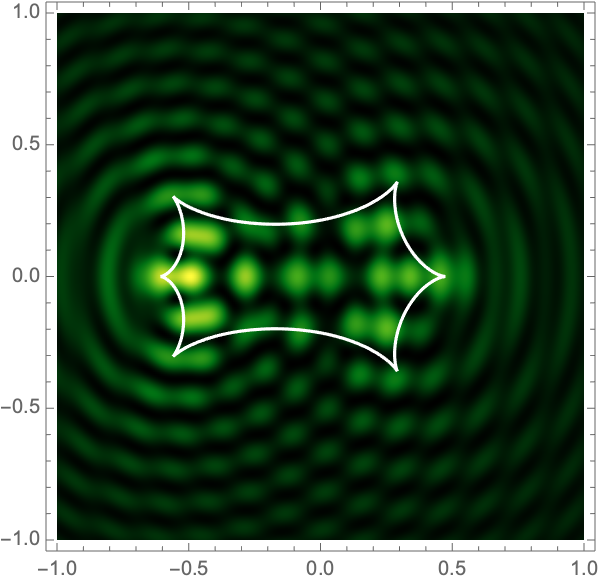</td>
<td>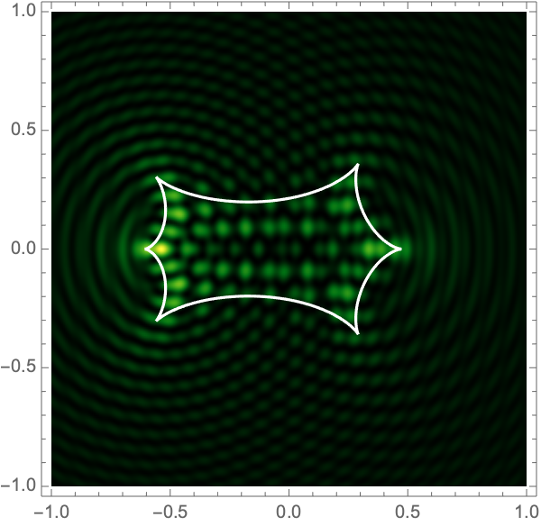</td>
<td></td>
<td></td>
</tr>
<tr>
<td>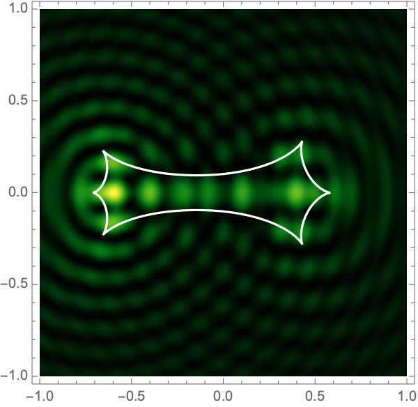</td>
<td></td>
<td></td>
<td>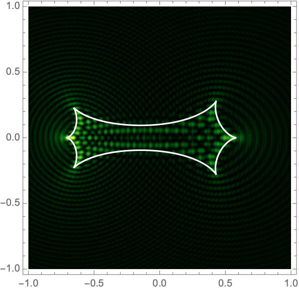</td>
</tr>
<tr>
<td>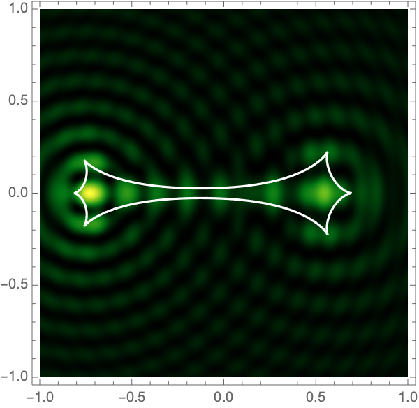</td>
<td>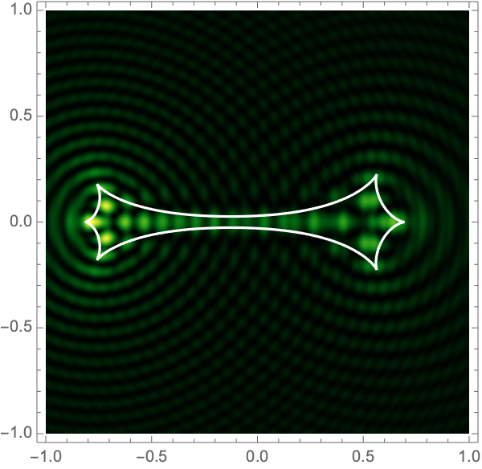</td>
<td>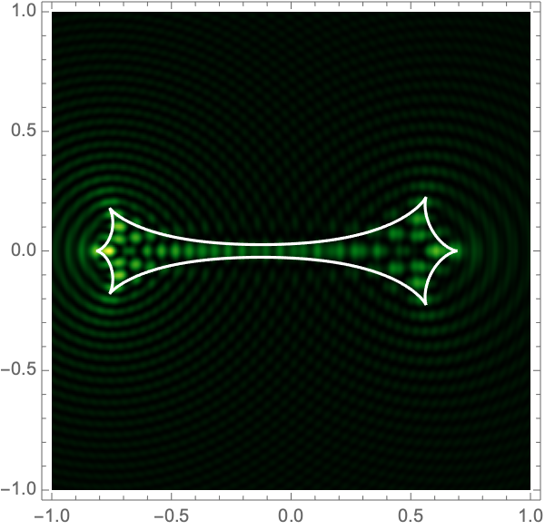</td>
<td>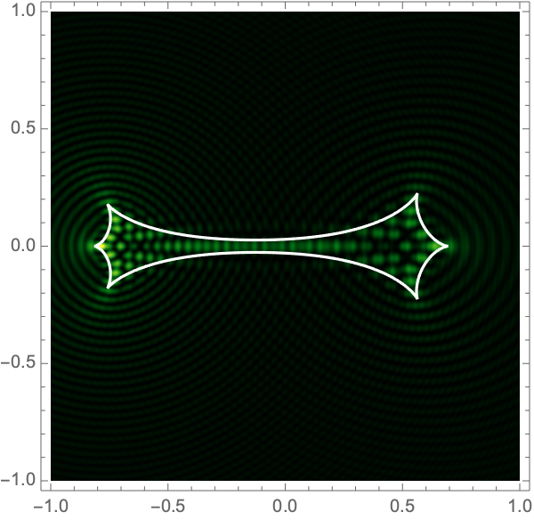</td>
</tr>
<tr>
<td>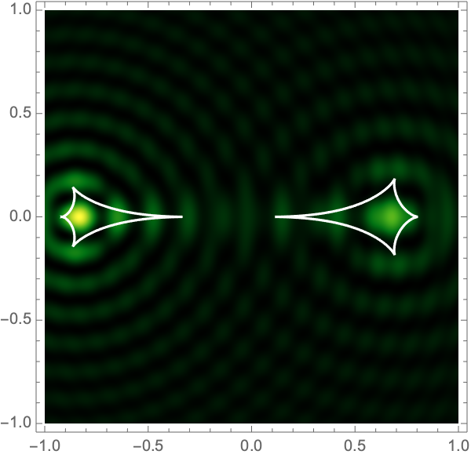</td>
<td></td>
<td>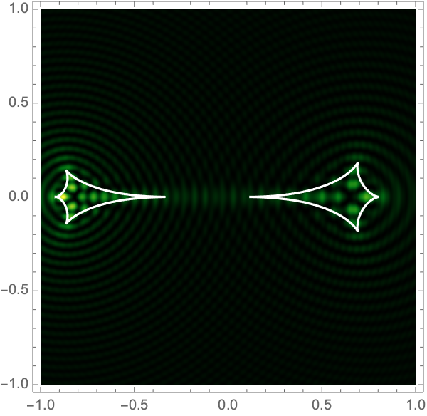</td>
<td></td>
</tr>
 </table>
 <figcaption> Fig. 7 - The intensity of the binary system with lens strength $f_1=1/3, f_2=2/3$, separation $a=0.1,0.2\dots,1.0$ (respectively from the upper to the lower rows), and the frequencies $\nu=25,50,75,$ and $100$ (respectively from left to right). The white curve is the caustic of the geometric optics approximation. </figcaption>
</figure>
