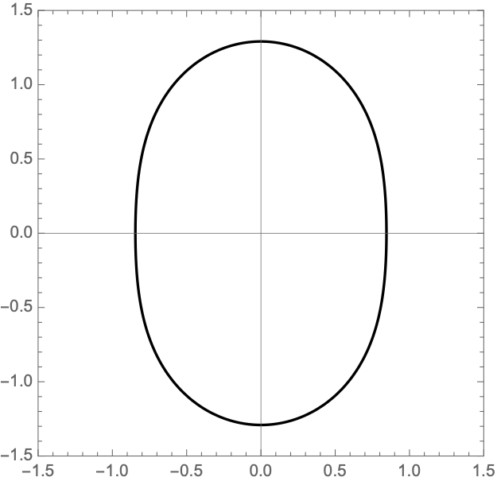
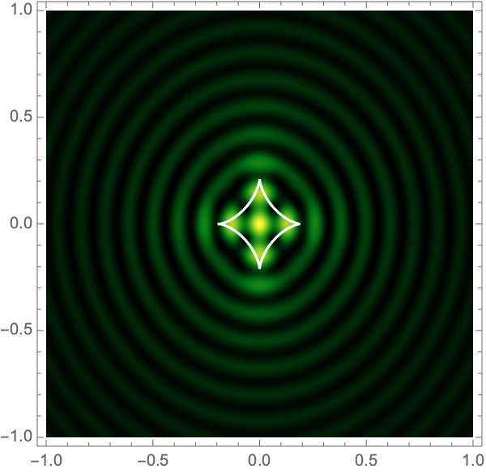
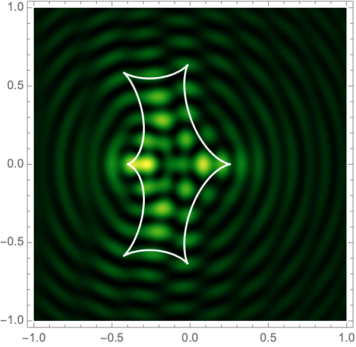
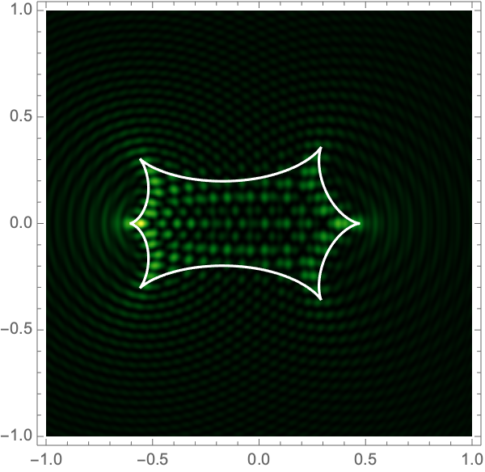

<!--- <a href="">Feldbrugge, and Turok (2020)</a> ---> 

We study gravitational lensing in the thin-lens approximation, which is valid when the length scale over which light is deflected is small as compared to the distances from source to lens or lens to observer. The path integral amplitude, normalized to unity in the absence of a lens, reduces in the small-angle (flat sky) approximation to a two-dimensional Kirchhoff-Fresnel integral

$$\psi(\boldsymbol{y}) = \frac{\Omega}{2\pi i} \int e^{i \Omega \left[{1\over 2}(\boldsymbol{x}-\boldsymbol{y})^2 + \varphi(\boldsymbol{x})\right]} \mathrm{d}\boldsymbol{x}.$$

Here, $\boldsymbol{y}$ and $\boldsymbol{x}$ denote the position on the sky and on the lens plane respectively. Both are expressed in units of the Einstein angle for the total lens mass. For gravitational lensing by $N$ point masses located at $\boldsymbol{x}_i$, $i=1,\dots N$ on the sky, the lensing phase takes the form

$$\varphi(\boldsymbol{x}) =- \sum_{i=1}^N f_i \log|\boldsymbol{x} - \boldsymbol{x}_i |\,,$$

with $f_i$ the mass fractions satisfying $\sum_{i=1}^N f_i=1$. The normalized intensity is given by the magnitude squared of the amplitude 

$$I(\boldsymbol{y}) = | \psi(\boldsymbol{y})|^2.$$

When the wavelength is small compared to the Schwarzchild radius for the lens mass, or when the radiation is incoherent, geometric (ray) optics provides an excellent approximation. However, when these conditions are not fulfilled, the interference pattern must be determined by evaluating the highly oscillatory Kirchhoff-Fresnel integral. We use Picard-Lefschetz theory to do so.

### Single gravitational lens
Generally, the Kirchhoff-Fresnel integral must be performed numerically. In the case of lensing by a single point source, *i.e.*, $\varphi(\boldsymbol{x}) = -\log x$ (where $x\equiv |\boldsymbol{x}|$) the integral may be given in closed form

$$I(\boldsymbol{y}) = \frac{\pi \Omega}{1-e^{-\pi \Omega}} |{}_1F_1(i \Omega / 2, 1; i \Omega y^2/2)|^2,$$

where ${}_1F_1$ is Kummer's confluent hypergeometric function. Figure 1 shows interference patterns for this case.

<figure>
<table align='left' width=100% id="FIG">
<tr>
<td></td>
<td></td>
<td></td>
<td></td>
</tr>
 </table>
 <figcaption> Fig. 1- The lensing pattern of a single gravitational lens for $\Omega=25,50,75$ and $100$ (from left to right). </figcaption>
</figure>

The result is beautifully simple but unrepresentative since a small perturbation of the lensing phase drastically alters the caustics and the consequent interference pattern. As a further step towards realism, we add a shear field:

$$\varphi(\boldsymbol{x}) = - \log x + \frac{1}{2}\gamma (x^2 - y^2),$$

with $\boldsymbol{x}=(x_1,x_2)$ and a shear strength $0\leq \gamma \leq 1$ as could, for example, represent the tidal force form an external mass located a distance $\gamma^{-1/2}$ from the lens. In geometric optics, the single lens with a shear field induces the Lagrangian map,

$$\xi(\boldsymbol{x}) = \left(1-\frac{1}{x}\right) \boldsymbol{x} +\gamma (-x1,x2),$$

sending points from the lens plane to the screen. This map forms a caustic at the critical curve defined by the condition $\det(\nabla \xi) = 0$,

$$\mathcal{M} =\left \{ r (\cos \theta, \sin \theta) \,\bigg| \,r = \frac{1}{\sqrt{1- \gamma^2}} \sqrt{ \sqrt{1-\gamma^2 \sin^2 2 \theta} -\gamma \cos 2 \theta} \text{ and } \theta \in [0,2\pi)\right\}.$$

See Fig. 2 for examples.
<figure>
<table align='left' width=100% id="FIG">
<tr>
<td></td>
<td></td>
<td></td>
<td></td>
</tr>
 </table>
 <figcaption> Fig. 2 - The critical curve for $\gamma = 0.1,0.2,0.3,$ and $0.4$ (from left to right). </figcaption>
</figure>

The Lagrangian map takes the critical curve to the caustic curve $\boldsymbol{\xi}({M})$ consisting of four fold curves running between four cusp points and forming a curved diamond. This diamond is the curve at which the intensity in the geometric optics approximation diverges. The Kirchhoff-Fresnel integral has generically four saddle points, with two or four being real depending on whether $\boldsymbol{y}$ is outside or inside the caustic curve. The outside and inside of the caustic curve are respectively double- and quadruple-image regions. 

To evaluate the lens in wave optics, we use polar coordinates centred at the lens: $\boldsymbol{x} = r(\cos \theta , \sin \theta )$. In these coordinates, the integrand is an analytic function of the radial and angular coordinates, 

$$\psi(\boldsymbol{y}) =\frac{\Omega}{2\pi i} \int_{0}^\infty \int_0^{2\pi} e^{i \Omega \left[ ((r\cos \theta - \mu_x)^2 + (r\sin \theta - \mu_y)^2) / 2 - \log r + \frac{\gamma }{2} r^2(\cos^2\theta - \sin^2\theta) \right]} r \mathrm{d} \theta \mathrm{d} r,$$

with $\boldsymbol{y} = (y_1,y_2)$. The radial integral is subtle since the integrand oscillates an infinite number of times. We use Picard-Lefschetz theory to perform it, at each value of $\theta$, defining

$$g_{\theta}(\boldsymbol{y}) = \int_{\mathcal{J}_\theta} e^{i \Omega \left[ {1\over 2}((r\cos \theta - x_1)^2 + (r\sin \theta - x_2)^2) - \log r + {1\over 2} \gamma r^2 \cos 2\theta \right] + \log r} \mathrm{d} r,$$

with the Lefschetz thimble $\mathcal{J}_\theta$ obtained by a continuous deformation of the original integration domain $(0,\infty)$ into the complex $r$-plane (see Fig. 3 for an example). This deformation removes the oscillations from the radial integral.

<figure>

<figcaption> Fig. 3 - The Picard-Lefschetz diagram for the radial variable for shear $\gamma=0.2$ and the angular variable $\theta = 0$. The black and blue curves are the steepest descent and ascent curves corresponding to the saddle points (the red points) of the $h$-function (the background image). The original integration domain $(0,\infty)$ is deformed to the Lefschetz thimbles (the blue curve) removing the oscillations of the integrand. The white vertical line is the branch cut of the logarithm, which we have placed to avoid the Lefschetz thimble.</figcaption>
</figure>

The remaining integral over $\theta$ 

$$\psi(\boldsymbol{y}) =\frac{\Omega}{2\pi i} \int_0^{2\pi} g_\theta (\boldsymbol{y})\mathrm{d}\theta,$$

can be evaluated with more traditional numerical methods. See Fig. 4 for the interference patterns of the single gravitational lens with a shear of $\gamma=0.1-0.5$ for $\Omega=25-100$.

<figure>
<table align='left' width=100% id="FIG">
<tr>
<td></td>
<td></td>
<td></td>
<td></td>
</tr>
<tr>
<td></td>
<td></td>
<td></td>
<td></td>
</tr>
<tr>
<td></td>
<td></td>
<td></td>
<td></td>
</tr>
<tr>
<td></td>
<td></td>
<td></td>
<td></td>
</tr>
 <tr>
 <td></td>
 <td></td>
 <td></td>
 <td></td>
 </tr>
 </table>
 <figcaption> Fig. 4 - The lensing of a single gravitational lens with background shear $\gamma =0.1, 0.2, 0.3, 0.4$ and $0.5$ (respectively the upper to the lower rows) and for $\Omega=25,50,75$ and $100$ (respectively the left to the right columns). The white curved diamond is the caustic of the geometric optics approximation. The rings at the corners for high frequency and shear are aliasing artifacts. </figcaption>
</figure>

### Binary gravitational lens
A binary gravitational lens has a lensing phase 

$$\varphi(\boldsymbol{x}) = -f_1 \log|\boldsymbol{x} + \boldsymbol{r}| - f_2 \log|\boldsymbol{x} - \boldsymbol{r}|.$$

with $\boldsymbol{r} = (a,0)$ for some $a>0$. The Lagrangian map

$$\xi(\boldsymbol{x}) = \left(x_1 - \frac{f_1(x_1+a)}{| \boldsymbol{x} + \boldsymbol{r}|} - \frac{f_2(x_1-a)}{| \boldsymbol{x} - \boldsymbol{r}|}, x_2 - \frac{f_1 x_2}{\| \boldsymbol{x} +\boldsymbol{r}\|} - \frac{f_2 x_2 }{| \boldsymbol{x} - \boldsymbol{2}|}\right)$$

can be used to construct the critical curve, $\mathcal{M} = \{\boldsymbol{x}| \det \nabla \xi(\boldsymbol{x}) = 0\}$ and the caustic curve, $\xi(\mathcal{M})$. It is straightforward to show that outside the caustic curve, three images contribute to the intensity. Two of these are mainly lensed by one of the two lenses and the third is lensed by the combined system. Inside the caustic curve is a five-image region.  

As with the single gravitational lens, it is awkward to apply Picard-Lefschetz methods in Cartesian coordinates since the integrand has branch cuts on the real axis. Instead we use elliptic coordinates, $\boldsymbol{x}(\tau,\sigma) = a(\cosh \tau \cos \sigma, \sinh \tau \sin \sigma)$, with $0 < \tau < \infty$ and $0 < \sigma \leq 2\pi$. Geometrically, these coordinates has two foci at the locations of the two lens masses $\mp\boldsymbol{r}$. The constant $\tau$ contours form ovals around the foci (the red curves in Fig. 5). The constant $\sigma$ contours pass between the two foci (the blue curves in Fig. 5). Note that the variables $\tau$ and $\sigma$ are analogous to $r$ and $\theta$ in 2d polar coordinates. 

<figure>

<figcaption> Fig. 5 - Elliptic coordinates for $a=1$. The red curves are the constant $\tau$ contours. The blue cirves are constant $\sigma$ contours. The black line segments connect the upper green point to the foci, at $\boldsymbol{x}=(\pm 1, 0)$, of the elliptic coordinate system.</figcaption>
</figure>

In elliptic coordinates, we obtain the identities

$$ \begin{aligned}
|\boldsymbol{x} +\boldsymbol{r}\| &= a(\cosh \tau + \cos \sigma),\\
|\boldsymbol{x} - \boldsymbol{r}\| &= a(\cosh \tau - \cos \sigma),
\end{aligned}$$

and the Jacobian

$$J(\tau,\sigma) = \frac{a^2}{2} \left( \cosh 2\tau - \cos 2 \sigma\right).$$

Following the calculation for the single gravitational lens, we perform the radial $\tau$-integral using Picard-Lefschetz theory

$$g_\sigma(\boldsymbol{y}) = \int_{\mathcal{J}_\sigma} e^{i \Omega \left[ \frac{1}{2}(\boldsymbol{x}(\tau,\sigma) - \boldsymbol{y})^2 - f_1 \log(a(\cosh \tau + \cos \sigma))- f_2 \log(a(\cosh \tau - \cos \sigma))\right] + \log J(\tau,\sigma)}\mathrm{d}\tau.$$

For this integral, it turns out to be most efficient to extend the original integration domain for $\tau$ to the real line. See Fig. 6 for two examples of the thimble $\mathcal{J}_\sigma$. 

<figure>
<table align='left' width=100% id="FIG">
<tr>
<td></td>
<td></td>
</tr>
 </table>
 <figcaption> Fig. 6 - The Picard-Lefschetz diagram in the complex $\tau$-plane for $\Omega=1,a=1$ for $\boldsymbol{y}=\boldsymbol{0}$ and $(1,0)$. The red points are the saddle points, the green points are the branch points and the blue curves are the relevant steepest descent contours. </figcaption>
</figure>

The amplitude is now expressed as an angular integral over a compact domain which we evaluate using conventional integration techniques

$$\psi(\boldsymbol{y}) = \frac{\Omega}{4\pi i} \int_0^{2\pi} g_{\sigma}(\boldsymbol{y}) \mathrm{d}\sigma.$$

Figure 7 shows intensity maps for lens strengths $f_1=1/3, f_2=2/3$, with separations $a=0.1-1.0$ and $\Omega=25-100$.

<figure>
<table align='left' width=100% id="FIG">
<tr>
<td></td>
<td></td>
<td></td>
<td></td>
</tr>
<tr>
<td></td>
<td></td>
<td></td>
<td></td>
</tr>
<tr>
<td></td>
<td></td>
<td></td>
<td></td>
</tr>
<tr>
<td></td>
<td></td>
<td></td>
<td></td>
</tr>
<tr>
<td></td>
<td></td>
<td></td>
<td></td>
</tr>
<tr>
<td></td>
<td></td>
<td></td>
<td></td>
</tr>
<tr>
<td></td>
<td></td>
<td></td>
<td></td>
</tr>
<tr>
<td></td>
<td></td>
<td></td>
<td></td>
</tr>
<tr>
<td></td>
<td></td>
<td></td>
<td></td>
</tr>
<tr>
<td></td>
<td></td>
<td></td>
<td></td>
</tr>
 </table>
 <figcaption> Fig. 7 - The intensity for a binary lens with $f_1=1/3, f_2=2/3$, separation $a=0.1,0.2\dots,1.0$ (respectively from the upper to the lower row), and $\Omega=25,50,75,$ and $100$ (from left to right). The white curve is the caustic of the geometric optics approximation. </figcaption>
</figure>
