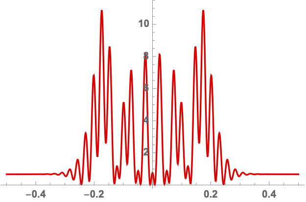

% Picard-Lefschetz Path Integrals
% Job Feldbrugge, Ue-Li Pen and Neil Turok

Interference is one of the most universal phenomena in nature. In classical physics, the linear superposition of sound waves, surface waves, radio waves, light or gravitational waves all exhibit the same characteristic patterns of constructive and destructive interference. Interference is also fundamental to quantum physics. The basic quantum amplitudes describing particles or fields are most elegantly formulated as path integrals – sums over trajectories weighted by the phase factor $e^{iS/\hbar}$ with $S$ the action and $\hbar$ Planck’s constant. As ubiquitous as interference and interference patterns are, they are generally hard to compute. The oscillatory integrals involved are only conditionally and not absolutely convergent, meaning they converge slowly and artefacts such as dependence on unphysical cutoffs may be hard to avoid. Likewise, if the integrals are performed iteratively, as is often the only practicable method, conditional convergence is in general insufficient to guarantee uniqueness, since the order in which partial integrals are taken can affect the result.  

Cauchy’s theorem allows one to transform a computationally fragile and expensive, highly oscillatory integral into an exactly equivalent sum of absolutely and rapidly convergent integrals which can be evaluated in polynomial time. We require only that it is possible to analytically continue the lensing phase, expressed in the integrated coordinates, into the complex domain. Picard-Lefschetz theory is a systematic method to find the optimal deformation of the integration domain. We here describe Picard-Lefschetz theory and provide a numerical implementation of Picard-Lefschetz theory for both one- and two-dimensional integrals accompanying the recent papers <a href="https://arxiv.org/abs/1909.04632">Feldbrugge, Pen, and Turok (2019)</a>, <a href="">Feldbrugge, Pen, and Turok (2020)</a>, and <a href="">Feldbrugge, and Turok (2020)</a>.

The C++ implementations of both the one- and two-dimensional Picard-Lefschetz integrator can be downloaded from the git repository

```
git clone https://github.com/jfeldbrugge/Picard_Lefschetz_Integrator.git
```

The source code can be compiled with the command

```
$ g++ -std=c++11 -O3 -march=native -ffast-math -o PL1D code1D/main.cpp
$ g++ -std=c++11 -O3 -march=native -ffast-math -o PL2D code2D/main.cpp
```

Note that the integrator can be run in parallel with the <a href="https://www.openmp.org">OpenMP interface</a>

```
$ g++ -fopenmp -std=c++11 -O3 -march=native -ffast-math -o PL1D code1D/main.cpp
$ g++ -fopenmp -std=c++11 -O3 -march=native -ffast-math -o PL2D code2D/main.cpp
```

The output of the binary file **result.bin**.

The published code evaluates the $n$-dimensional Kirchhoff-Fresnel integral

$$\psi(\boldsymbol{\mu}) = \left(\frac{\nu}{2\pi i}\right)^{n/2} \int e^{i \nu \left[(\boldsymbol{x}-\boldsymbol{\mu})^2/2 + \varphi(\boldsymbol{x})\right]} \mathrm{d}\boldsymbol{x}$$

with $n=1,2$, where the exponent is specified in the function 
```c++
std::complex<double> func();
```

<figure>
<table align='left' width=100% id="FIG">
<tr>
<td></td>
<td></td>
<td></td>
</tr>
 </table>
 <figcaption> Fig.1 - The frequency pattern of a thin lens with frequencies $\nu=50,100$ and $500$.</figcaption>
</figure>


### Picard-Lefschetz theory
Consider the oscillatory integral
$$I = \int_{\mathbb{R}^n} e^{i \phi(\boldsymbol{x})}\mathrm{d}\boldsymbol{x},$$
with the analytic exponent of the integrand $\phi:\mathbb{R}^n \to \mathbb{C}$. Note that when the function $\phi$ is real, the integral can only be conditionally convergent. Such an integral is often difficult to define and expensive to evaluate due to violent oscillations. We can improve the properties of the integral with Cauchy's theorem. We analytically continuing the integrand into the complex plane $\mathbb{C}^n$ and continuously deforming the integration domain to the Lefschetz thimble $\mathcal{J} \subset \mathbb{C}^n$ while keeping the endpoints fixed, removing the oscillatons, 

$$I = \int_{\mathcal{J}} e^{i \phi(\boldsymbol{x})}\mathrm{d}\boldsymbol{x}.$$

To obtain the Lefschetz thimble, we first express the exponent $i\phi$ in terms of a real and an imaginary part

$$i\phi(\boldsymbol{x}) = h(\boldsymbol{x}) + i H(\boldsymbol{x}).$$

Note that $h$-function determines the magnitude of the integrand, *i.e.*, $|e^{i\phi}| = e^{h}$. We define the downwards flow $\gamma_\lambda:\mathbb{C}^n\to \mathbb{C}^n$ of the $h$-function as

$$ \frac{\mathrm{d} \gamma_{\lambda}(\boldsymbol{x}_0)}{\mathrm{d}\lambda} = -\nabla h(\gamma_\lambda(\boldsymbol{x}_0)),$$

with the boundary condition $\gamma_0(\boldsymbol{x}_0) = \boldsymbol{x}_0 \in \mathbb{C}^n$. The downward flow defines a continuous deformation of the integration domain $\gamma_\lambda(\mathbb{R}^n),$ from the original domain at $\lambda=0$ to the Lefschetz thimble in the limit $\lambda \to \infty$,

$$\mathcal{J} =\lim_{\lambda \to \infty} \gamma_\lambda(\mathbb{R}^n).$$

Note that, when the endpoints of the original integration domain are located on singularities of the exponent, such as for the Kirchhoff-Fresnel integral, the flow automatically preserves the endpoints. Since the thimble $\mathcal{J}$ is a fixed point of the downward flow $\gamma_\lambda$, it can generally be expressed as a formal sum over steepest descent contours

$$ \mathcal{J} = \sum_i n_i \mathcal{J}_i,$$

with $n_i \in \mathbb{Z}$ and $\mathcal{J}_i$ the steepest descent contour of the saddle point $\bar{\boldsymbol{x}}_i \in \mathbb{C}^n$ of the exponent $i\phi.$ Using the Cauchy-Riemann equation, $\nabla h \cdot \nabla H = 0$, it straigforwardly follows that the imaginary part, $H$, is constant along the steepest descent contours, *i.e.*,

$$H(\boldsymbol{x})|_{\mathcal{J}_i} = H(\bar{\boldsymbol{x}}_i),$$

removing the oscillations of the integral, *i.e.*,

$$I = \int_{\mathcal{J}} e^{i\phi(\boldsymbol{x})} \mathrm{d}\boldsymbol{x} = \sum_i n_i e^{i H(\bar{\boldsymbol{x}}_i)} \int_{\mathcal{J}_i} e^{h(\boldsymbol{x})}\mathrm{d}\boldsymbol{x}.$$

For more details see ...

#### An example, the Fresnel integral
The Fresnel integral

$$I_F = \int_{-\infty}^{\infty} e^{i x^2} \mathrm{d}x,$$

is a typical example of a conditionally convergent integral, *i.e.*, $|e^{ix^2}| = 1$. The integral is often defined in the limit $I_F = \lim_{R\to \infty}I_F(R)$, with the partial integral

$$ I_F(R) = \int_{-R}^{R} e^{ix^2}\mathrm{d}x.$$

In the limit $R \to \infty$, the partial integral $I_F(R)$ runs over an Euler spiral in the complex plane converging to the point $(1+i) \sqrt{\pi / 2}$ (see Fig. 2).

<figure>

<figcaption> Fig.2 - The partial Fresnel integral $I_F(R)$ (the red point) in the complex plane as a function of $R$ tracing the Euler spiral ending $(1+i)\sqrt{\pi/2}$ (the blue point). </figcaption>
</figure>

This is a good definition of the one-dimensional Fresnel integral. However, it is delicate, inefficient and does not easily generalize to multi-dimensional conditionally convergent integrals where the result can depend on the way we take the limit. Instead, we can analytically extend the exponent into the complex plane $\mathbb{C}$ and use the downward flow $\gamma_\lambda$ 

$$\gamma_\lambda(\boldsymbol{x}_0) = [x_{r0} \cosh(2\lambda) + x_{i0} \sinh(2\lambda)] + [x_{r0} \sinh(2\lambda) + x_{i0} \cosh(2\lambda)] i$$

with $\text{Re}[x_0]=x_{r0}$ and $\text{Im}[x_0]=x_{i0}$, to obtain the Lefschetz thimble 

$$ \mathcal{J} = \lim_{\lambda\to \infty}\gamma_{\lambda}(\mathbb{R}) = \{(1+i)u | u \in \mathbb{R}\}.$$ 

Along the Lefschetz thimble, the Fresnel integral is transformed into the Gaussian integral

$$I_F=\int_{\mathcal{J}} e^{i x^2}\mathrm{d}x = (1+i) \int_{-\infty}^{\infty} e^{- 2 u^2}\mathrm{d}u = (1+i)\sqrt{\pi/2},$$

removing the oscillations from the definition of the Fresnel integral. Note that since the resulting integral is absolutely convergent, the definition is robust. This definition, moreover, straightforwardly generalizes to multi-dimensional integrals removing the ambiguities of the limit (see Fubini's theorem).

### Numerical Picard-Lefschetz theory
Picard-Lefschetz theory can be used to efficiently evaluate oscillatory integrals. We here describe the essence of a numerical scheme for the downward flow of the integration domain and a Romberg scheme for the evaluation of the integral along the Lefschetz thimble.

#### Discretizing the integration domain
We first discretize the original integration domain. In the one-dimensional case, we represent a segment of the real line $\mathbb{R}$ by a collection of line segments 

$$J = \{(l_1,l_2), (l_2,l_3),\dots \},$$

with $l_i \in \mathbb{N}$, referring to a point $x_{l_i}$ in the set 

$$S = \{x_1,x_2,\dots\} \subset \mathbb{C},$$

seperated by no more than $\delta$, *i.e.*, if $(i,j) \in J$ we we impose the condition $|x_i - x_j| < \delta$. In the two-dimensional case, we represent a segment of the real plane $\mathbb{R}^2$ by a collection of quadrilaterals

$$J = \{(l_1,l_2,l_3,l_4),(l_5,l_6,l_2,l_1),\dots\},$$

with $l_i \in \mathbb{N}$, referring to a point $\boldsymbol{x}_{l_i}$ in the set 

$$S = \{\boldsymbol{x}_1,\boldsymbol{x}_2,\dots\} \subset \mathbb{C}^2,$$

with the property that when $(i,j,k,l) \in J$, the sides of the quadrilateral are smaler than $\delta$, *i.e.*, $\text{max}(\| \boldsymbol{x}_i - \boldsymbol{x}_j\|, \| \boldsymbol{x}_j - \boldsymbol{x}_k\|, \| \boldsymbol{x}_k - \boldsymbol{x}_l\|, \| \boldsymbol{x}_i - \boldsymbol{x}_l\|) < \delta$. The simplices in $J$ are implemented in the **simplex** class

```c++
class simplex;
```
The class in addition to the labels to the points includes the boolean **active** which marks whether the simplex is still in use. The points in $S$ are implemented by the **cp** struct, associating a boolean **active** to the complex point

```c++
struct cp {
 pointC p;
 bool active;
};
```
#### The downward flow of a simplex
The downward flow of the integration domain $J$ is implemented with the Euler method, *i.e.*, for all points $\boldsymbol{x}$ in $S$, shift their positions with the rule

$$ \boldsymbol{x} \mapsto \boldsymbol{x} - \tau \frac{\nabla h(\boldsymbol{x})}{\|  \nabla h(\boldsymbol{x}) \|}$$

with step size $\tau>0$, implemented in the function **flow**

```c++
void flow();
```
We normalize the gradient to improve the behaviour of the flow in the vicinity of singularities in the $h$-function. A point in the set $S$ is turned inactive when the $h$-function drops below the threshold **thres**. The threshold determines the accuracy of the approximation of the integral.

#### Subdivision of simplices
After each iteration of the flow, we check whether the points of an active simplex are still active. If not, we turn the simplex inactive. For every active simplex, we check whether the separations of the edges is still smaller than $\delta$. When an active simplex has an edge exceeding $\delta$, we replace the simplex by two new simplices. That is to say, in the one-dimensional case, when $(i,j) \in J$ refers to two points with a larger separation then $\delta$, *i.e.*, $|x_i - x_j|$ we add a new point $x_k = (x_i + x_j) / 2$ to the set $S$ and replace the simplex by the new simplices $(i,k)$ and $(k,j)$. The old simplex is turned inactive. The two-dimensional case follows analogously. This is implemented in the function **subdivide**

```c++
void subdivide();
```
By iterating the **flow** and the **subdivide** routine, the simplices $J$ will approach the Lefschetz thimble $\mathcal{J}$. There are several ways in which we check whether the simplices $J$ have converged to the Lefschetz thimble. In the presented implementation we iterate for a fixed number of steps. After we have found the thimble, we bake the points into the **simplex** class of $J$ and delete the set $S$.

Since the flow turns simplices inactive in the **flow** routine and replenishes them in the **subdivide** routine, we remove any inactive simplices from $J$ with the **clean** routine 

```c++
void clean();
```

before evaluating the integral.

#### Romberg integration

Given the simplicial approximation $J$ of the Lefschetz thimble $\mathcal{J}$, we evaluate the integral piecewise with a <a href="https://en.wikipedia.org/wiki/Romberg%27s_method">Romberg integration scheme</a>. Given an active simplex in $J$, we evaluate the trapezium rule on the simplex $T(1)$ and $N$ refinements of the simplex $T(2),T(3), \dots, T(N)$. At each refinement we half the present simplices. Note that for the trapezium rule, the approximation $T(i)$ can be used in the efficiently evaluation of the refinement $T(i+1)$. Given the set of approximations $T(1),T(2),\dots,T(n)$ of the integral over a simiplex in $J$, we use <a href="https://en.wikipedia.org/wiki/Richardson_extrapolation">Richardson extrapolation</a> to improve the convergence to the true integral. The Romberg method is implemented in the function 
```c++
std::complex<double> romberg();
```

For a detailed discussion of one- and two-dimensional Romberg integration see <a href="https://www.tandfonline.com/doi/abs/10.1080/10637199408962543?needAccess=true&journalCode=gpaa19">Evans and Bahoshy (1993)</a>.

#### Evaluating a family of integrals
In practice, one rarely wants to evaluate a single integral. When the set of integrals is a smooth family, such as for the Kirchhoff-Fresnel integral, we can construct a catalogue of thimbles $J_i$ for a range of external parameters $\boldsymbol{\mu}_i$. When we want to evaluate the integral for a specific parameter $\boldsymbol{\mu}$, we find the thimble corresponding to the closest point in the catalogue and evaluate the integral along this thimble. Note that while this thimble $J_i$ is not the optimal integration contour for the parameter $\boldsymbol{\mu}$, Cauchy's integral theorem guarantees that the integral does not depend on the details of the thimble. The integrand along this suboptimal thimble will generally quickly decay and be only mildly oscillate. 

### Applications
The Picard-Lefschetz integrator can be applied to a wide range of problems. We here demonstrate the code with a few lensing problems. In the thin-lens approximation, the amplitude for a photon to be at the point on the screen $\boldsymbol{\mu}$ is given by the Kirchhoff-Fresnel integral

$$\psi(\boldsymbol{\mu}) = \left(\frac{\nu}{2\pi i}\right)^{n/2} \int e^{i \nu \left[(\boldsymbol{x}-\boldsymbol{\mu})^2/2 + \varphi(\boldsymbol{x})\right]} \mathrm{d}\boldsymbol{x}$$

with the position on the lens $\boldsymbol{x}$, the phase variation of the lens $\varphi$, and the frequency of the radiation $\nu$. The intensity is given by the magnitude squared of the amplitude
$$I(\boldsymbol{\mu}) = |\psi(\boldsymbol{\mu})|^2.$$

#### One-dimensional plasma lens
Consider the toy model of a one-dimensional lens consisting of a single blob

$$\varphi(x) = \frac{\alpha}{1+x^2}$$

with $\alpha$ the strength of the lens. The numerical Picard-Lefschetz scheme can be used to flow the original integration domain $\mathbb{R}$ to the Lefschetz thimble $\mathcal{J}$. See Fig. 3 for flow to the Lefschetz thimble for the lens strength $\alpha =2$ at the centre of the lens $\mu=0$. In this configuration, only the three real saddle points corresponding to three real geometric images are relevant to the integral.

<figure>

<figcaption> Fig.3 - The flow of the integration domain to the thimble for the lens strength $\alpha =2$ and $\mu = 0$. In the gray regions the $h$-function drops below the threshold. </figcaption>
</figure>

We can efficiently evaluate the Kirchhoff-Fresnel integral along the Lefschetz thimble using a Romberg integration scheme (see Fig. 4 ). For more details see <a href="https://arxiv.org/abs/1909.04632">Feldbrugge, Pen, and Turok (2019)</a>.

<figure>
<table align='left' width=100% id="FIG">
<tr>
<td></td>
<td></td>
<td></td>
</tr>
 </table>
 <figcaption> Fig.4 - The intensity pattern of the one-dimensional localized lens with the lens strenght $\alpha =2$ for the frequencies from left to right $\nu=50,100$ and $500$.</figcaption>
</figure>

#### Two-dimensional plasma lens
Consider the two-dimensional toy model consisting of an asymetric blob

$$
\varphi(\boldsymbol{x}) = \frac{0.65}{1+ x^2 + 2 y^2}.
$$

This is the lens integral solved in the example code.

<figure>

<figcaption> Fig. - A two-dimensional lens as a function of the frequency. </figcaption>
</figure>


#### Random lens
Lensing by a random or turbulent medium can be modelled by a random phase variation $\varphi$. We will here assume the phase to be a realization of a Gaussian random field. See Fig. 5 for an illustration of an interference pattern corresponding to a random lens with the power-law power spectrum $P(\boldsymbol{k}) \propto k^{-1}$. For more details see <a href="">Feldbrugge, Pen, and Turok (2020)</a>. For more details see <a href="klwo.html">Kolmogorov lenses</a>.

<figure>
<table align='left' width=100% id="FIG">
<tr>
<td></td>
<td></td>
<td></td>
</tr>
<tr>
<td></td>
<td></td>
<td></td>
</tr>
 </table>
 <figcaption> Fig.5 - The intensity pattern due to lensing by a random screen with a power-law power spectrum $P(\boldsymbol{k}) \propto k^{-1}$ for a range of frequencies $\nu=50, 100, 200, 400, 800,$ and $1600$ spanning the complete wave optics regime. The red curves display the caustics of the geometric optics approximation.</figcaption>
</figure>

#### Gravitational lensing
A gravitational lens consisting of $N$ point-sources positioned at $\boldsymbol{x}_i$ in the thin-lens approximation has a phase variation of the form

$$\varphi(\boldsymbol{x}) =- \sum_{i=1}^N f_i \log(\|\boldsymbol{x} - \boldsymbol{x}_i\|),$$

with $f_i$ the relative strength of the lenses (determined by the masses of the sources), with $f_1+\dots + f_N=1$. We here consider both the single gravitational lens with a shear term due to either nearby planet/star or the host galaxy and the binary lens problem. For more details see <a href="glwo.html">gravitational lenses</a>.

##### Single gravitational lens with a shear term
The single gravitational lens is one of the few Kirchhoff-Fresnel integrals with a known closed-form solution. However, this result is not representative for the lensing by a planet or star as a small perturbation will dramatically alter the diffraction pattern. We, for this reason, consider a single gravitational lens with a shear field,

$$\varphi(\boldsymbol{x}) = - \log(\|\boldsymbol{x}\|) + \frac{1}{2}\gamma (x^2 - y^2)$$

with $\boldsymbol{x}=(x,y)$ and the strength of the shear $0\leq \gamma \leq 1$. The corresponding intensity pattern for a mild shear $\gamma=0.2$ for the frequencies $\nu=25,50,75$ is illustrated in Fig. 6. For details see <a href="">Feldbrugge, and Turok (2020)</a>.

<figure>
<table align='left' width=100% id="FIG">
<tr>
<td></td>
<td></td>
<td></td>
</tr>
 </table>
 <figcaption> Fig.6 - The lensing of a single gravitational lens with shear $\gamma =0.2$ for the frequencies $\nu=25,50,75$. The white dotted line is the caustic from the geometric optics approximation. </figcaption>
</figure>

##### Binary gravitational lens
We finally consider the gravitational binary lens in wave optics, with the phase variation

$$\varphi(\boldsymbol{x}) = - f_1 \log(\|\boldsymbol{x} - \boldsymbol{r}\|) - f_2 \log(\|\boldsymbol{x} + \boldsymbol{r}\|).$$

We will evaluate the interference pattern for a situation in which the two souces are separated by the Einstein radius $\boldsymbol{r} = (0,1/2)$ and the left source is twice as heavy as the right source, $f_1=1/3$ and $f_2=2/3$. See Fig. 7 for the geometric optics prediction and the interference patterns for the frequencies $\nu=25, 50$ and $75$. For more details see <a href="">Feldbrugge, and Turok (2020)</a>.

<figure>
<table align='left' width=100% id="FIG">
<tr>
<td></td>
<td></td>
<td></td>
</tr>
 </table>
 <figcaption> Fig.7 - The intensity pattern of a binary gravitational lens with $f_1=1/3,f_2=2/3$ seperated by an Einstein radius, $\boldsymbol{r}=(0,1/2)$ for the frequencies $\nu=25, 50$ and $75$ (from left to right). The white dotted line is the caustic obtained in the geometric optics approximation.</figcaption>
</figure>
