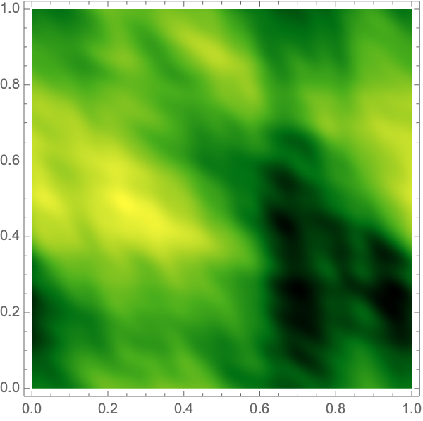
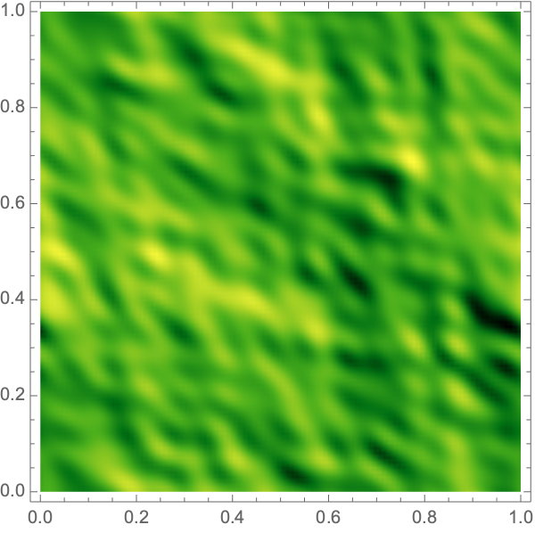

<!--- <a href="">Feldbrugge, and Turok (2020)</a> ---> 

We consider lensing by a plasma whose electron density takes the form of a Gaussian random field with a Kolmogorov power spectrum: in the thin lens approximation, the lens is effectively two-dimensional and the power spectrum $P(k)\propto k^{-{5\over 3}}$. This is a good model for twinkling produced by a turbulent medium.

The following picture shows a realization of the lens:

<figure>

<figcaption> Fig. 1- A 2d Gaussian random lens with a Kolmogorov power spectrum. </figcaption>
</figure>

We calculate the intensity pattern produced by this lens, comprising an intricate caustic network with diffraction fringes:

<figure>
<table align='left' width=100% id="FIG">
<tr>
<td></td>
<td></td>
<td></td>
<td></td>
</tr>
<tr>
<td></td>
<td></td>
<td></td>
<td></td>
</tr>
<tr>
<td></td>
<td></td>
<td></td>
<td></td>
</tr>
<tr>
<td></td>
<td></td>
<td></td>
<td></td>
</tr>
<tr>
<td></td>
<td></td>
<td></td>
<td></td>
</tr>
 </table>
 <figcaption> Fig. 2- The intensity pattern produced by lensing of the 2d Kolmogorov lens, for various lens strengths.</figcaption>
</figure>

We also consider a 2d Gaussian random field with a  power spectrum $P(k)\propto k^{-1}$:

<figure>

<figcaption> Fig. 3- A realization of a random lens with power spectrum $P(k)\propto k^{-1}$. </figcaption>
</figure>

The intensity pattern for this case are shown below, again for various lens strengths.

<figure>
<table align='left' width=100% id="FIG">
<tr>
<td></td>
<td></td>
<td></td>
<td></td>
</tr>
<tr>
<td></td>
<td></td>
<td></td>
<td></td>
</tr>
<tr>
<td></td>
<td></td>
<td></td>
<td></td>
</tr>
<tr>
<td></td>
<td></td>
<td></td>
<td></td>
</tr>
<tr>
<td></td>
<td></td>
<td></td>
<td></td>
</tr>
</table>
 <figcaption> Fig. 4- The intensity pattern produced by a 2d plasma lens with power spectrum $P(k)\propto k^{-1}$, for various strengths of the lens.</figcaption>
</figure>
